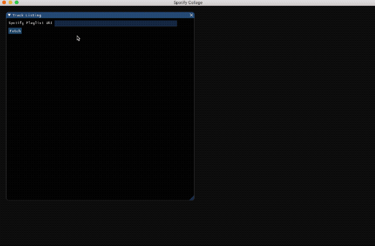

## What is this?
This is a desktop application that allows you to stitch together a collage of covers of all the albums in a Spotify playlist.

## But why?
While this application might have some utility for others, it exists mostly to scratch a personal itch.

Each year I put together a playlist of songs I discovered and enjoyed that year. This is accompanied by a blog post for which I use a collage of album art covers. I already have a [command line tool](https://github.com/deepakg/spotify) that makes the collage, but I was looking for an excuse to play with the excellent [ImGui](https://github.com/ocornut/imgui) library.

## What do I need to run this?
- Python 3.6 or higher
- pillow
- bimpy
- requests
- spotipy

You'll also need to obtain a client id and secret from [Spotify](https://developer.spotify.com/dashboard/applications) and store it in a .ini file called `.api_keys` in your home directory:

```
[spotify]
client_id=<client_id>
client_secret=<client_secret>
```

I've only tested this on macOS.

## The application starts, what now?
Enter the Spotify playlist URI in the Playlist URL textbox. Click the Fetch button. It'll retreive all the tracks in the playlist and open a second window with all the album art thumbnails. This second window has a 'Save Collage' button. Clicking it will save the collage as <playlist_id>.png in the directory from which you ran the application. If an album appears multiple times in a playlist, it'll only be used once in the collage.

## Known issues
There seems to be an issue with bimpy on macOS that causes high CPU utilisation when the application window doesn't have focus. It also throws warnings on the latest version of Python (3.8). The bimpy project haas [an open pull request](https://github.com/podgorskiy/bimpy/pull/15) and [a bug report](https://github.com/podgorskiy/bimpy/issues/22) for each of these issues respectively, so it should get picked up eventually. If not, I might consider moving to another [imgui binding](https://github.com/swistakm/pyimgui).

## Wishlist
- Use higher resolution thumbnails for collage (currently uses 64x64)
- Allow customisations:
    - Let the user specify the number of rows and columns in the collage (currently hard-coded to 8 columns)
    - Give an option to keep or discard the last row if it doesn't have enough thumbnails to fill all the columns (currently partial last row is kept and filled with black colour)
    - If user decides to keep the partial last row, allow the background colour to be customised
    - Padding/Borders
- Let the user pick where they want the collage saved.